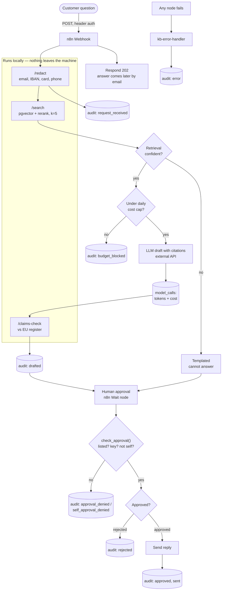

# Approval-gated knowledge assistant

A customer-service assistant that answers product and policy questions from a document set, cites its sources, and **cannot send anything without a human approving it**. Orchestration in self-hosted n8n, retrieval in a small Python service over PostgreSQL + pgvector, every step written to an append-only audit log.

Demo domain: sports-nutrition products and shop policies. It is a portfolio project, built on one laptop, and has never been used with real customer data.

## Architecture



Retrieval, embeddings and reranking run locally against PostgreSQL + pgvector. Only the drafting step calls an external API, and only with redacted text. Every `audit:` box is an append-only row that n8n's database role can insert but never change.

## What it does

- **Redacts structured personal data** (email, IBAN, card, phone, postcode+town) before retrieval or drafting. Names are *not* caught — see GOVERNANCE.md §4.
- **Retrieves** from 422 chunks: 407 real products (Open Food Facts) and 15 sections of sample shop policies. Vector search in pgvector, then a cross-encoder rerank, with slots reserved for each source type.
- **Refuses low-confidence questions** before any model call.
- **Stops at a daily cost cap**, enforced in the database.
- **Drafts with citations** to chunk ids, and is instructed to say when it doesn't know.
- **Flags health claims** that don't match the EU register of authorised claims — a heuristic prompt for the approver, *not* a compliance check.
- **Requires approval from a listed approver**, who may not be the person who asked. Refusals are audited.
- **Logs everything** to an append-only table: UPDATE, DELETE and TRUNCATE are blocked by triggers, and n8n's database role has INSERT only.

## Measured results

All numbers come from `EVIDENCE.md`, which records the command, date and data for each. Nothing here is estimated.

**Retrieval**, 60 hand-checked questions (45 answerable), measured at k=5:

| Mode | hit@5 | hit@1 | MRR@5 | p50 latency |
|---|---|---|---|---|
| Vector only | 0.867 | 0.733 | 0.787 | 19 ms |
| Vector + rerank | 0.844 | 0.733 | 0.789 | 219 ms |
| **Balanced** (per-source rerank) | **0.911** | 0.756 | 0.821 | 150 ms |

Reranking everything together *helped products* (hit@5 0.864 → 0.955) and *hurt policies* (0.833 → 0.667): it promotes product chunks whenever a policy question mentions a product. Reserving slots per source fixes that. The balanced design was chosen after seeing failures on this same question set, so it is a development-set result, and the differences are 2–3 questions out of 45.

**Caveat on the question set:** the 60 questions were generated by an LLM from the corpus and checked by hand, not written from scratch. Product questions were drawn from a seeded random sample of 40 products.

**End to end:** one full run (webhook → redact → search → budget → draft → claims check → approval → send) used 1,304 input and 447 output tokens. The budget gate was verified by setting the cap to 0 and confirming the run stopped before the model call; the confidence gate refused a vague request at a score of −5.68.

## Data sources

- **Open Food Facts** — 600 products fetched 2026-09-22 from two categories sold in Germany (`en:bodybuilding-supplements`, `en:protein-bars`), 408 unique. Database under **ODbL 1.0**, contents under **DbCL 1.0**, images **CC BY-SA 3.0**. Source: https://openfoodfacts.org. The snapshot is not committed; `scripts/fetch_off_subset.py` rebuilds it. A derived database redistributed publicly would have to stay under ODbL.
- **EU register of nutrition and health claims** — 2,337 records (269 authorised) downloaded 2026-09-23 from the European Commission's Food and Feed Information Portal. Check the portal's legal notice for reuse terms.
- **Sample policies** (`docs/samples/`) — returns, shipping and allergens, written for this demo. They describe **no real company** and are labelled as samples in every file.

## Running it

```bash
cp .env.example .env            # then fill in the secrets
docker compose up -d            # n8n + PostgreSQL with pgvector
cd retrieval && uv sync
uv run migrate                  # apply db/schema/*.sql
python3 ../scripts/fetch_off_subset.py
uv run ingest                   # chunk + embed the corpus
uv run ingest-claims            # load the EU claims register
uv run retrieval                # the search/redact/claims service on :8000
uv run pytest                   # 110 tests
```
Then import `workflows/*.json` into n8n at http://localhost:5678 and create the credentials listed in `docs/day4_n8n_guide.md`.

Models are cached in `.cache/` (about 940 MB); `rm -rf .cache` removes them.

## Honest notes

- **The drafting model is not a frontier LLM.** It currently runs on `openai/gpt-oss-120b` via Groq's free tier, because no Anthropic API credit was available. The call is plain HTTP and an eg: Claude prices are already in the database. `cost_usd` is therefore 0.00: the tier is free, not the pipeline cheap.
- **The claims-check threshold is provisional**, set from five example sentences. No precision figure is claimed.
- **Known gaps are listed in GOVERNANCE.md §8**, including approval by bearer URL, self-declared requester identity, unredacted names and no retention limit on the audit log.

## Documentation

- `GOVERNANCE.md` — data flow, what reaches which model, PII, retention, roles, credentials, gaps
- `EVIDENCE.md` — every measurement with its command and date
- `docs/day4_n8n_guide.md` — the workflow node by node
